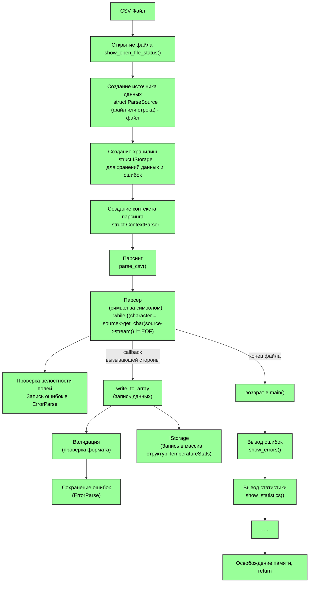

## Содержание
* [1. Сборка](#1-сборка)
* [2. Архитектура](#2-архитектура)
* [3. Основные компоненты](#3-основные-компоненты)

## 1. Сборка

##### Склонировать каталог с ДЗ
* Создать где-то каталог, зайти в него, открыть в нем терминал.
* Ввести в терминале: 
```Bash
git clone --no-checkout https://github.com/w-popov/c_base.git

cd c_base/
git sparse-checkout set HW12
git checkout
cd HW12/
```

##### Сборка:
* Режим отладки:
```Bash
make
```
или
```Bash
mingw32-make.exe
```
* Release режим:
```Bash
make DEBUG=0
```
или
```Bash
mingw32-make.exe DEBUG=0
```
Исходные файлы ```.c``` находятся в ```src/```, файлы ```.h``` в ```src/headers```. Исполняемые файлы лежат в ```build/debug/bin``` и в ```build/release/bin```. Каталог ```build``` и его подкаталоги с файлами сгенерируется после запуска make с указанным режимом сборки.
Для облегчения тестирования/отладки создается копия исполняемого файла в корневой каталог.

## 2. Архитектура

## 3. Основные компоненты

#### IStorage
Абстрактный интерфейс для работы с коллекциями данных parcer_csv.h:
```C
struct IStorage;

// Указатели на интерфейсные ф-ции
typedef void*   (*StoragePush)(struct IStorage *self, void *item);
typedef void*   (*StorageGet)(struct IStorage *self, size_t index);
typedef void    (*StorageFree)(struct IStorage *self);
typedef size_t  (*StorageSize)(struct IStorage *self);
typedef void*   (*StorageData)(struct IStorage *self);

struct IStorage 
{
    StoragePush push;           // Добавить элемент
    StorageGet get;             // Получить элемент по индексу
    StorageFree free;           // Полностью освободить память
    StorageSize size;           // Кол-во элементов в хранилище
    StorageData raw_data;       // Указатель массив данных
};
```
SVector — Динамический массив. SVector уже реализован в модуле parcer_csv.c

```C
struct SVector
{
    struct IStorage storage;  // Интерфейс
    void *data;               // Указатель на данные
    size_t capacity;          // Ёмкость (выделено памяти)
    size_t size;              // Текущее количество элементов
    size_t size_item;         // Размер одного элемента
};
```
##### Особенности:

* Автоматическое расширение при заполнении
* Начальная ёмкость: 1024 элемента
* Коэффициент расширения: ×4

#### Инициализация
```C
/**
 * @brief Инициализация.
 * @param *storage хранилище
 * @param size_item размер элемента вектора
 * @param cap задать ёмкость, если передано 0, то ёмкость по умолчанию
 * @return указатель на хранилище, или NULL 
 */
struct IStorage* svector_init(struct IStorage *storage, size_t size_item, size_t cap)
{
    if (!storage || !size_item)
    {
        return NULL;
    }
    /* Присвоение интерфейсным функциям указателей конкретных функций вектора */
    storage->push = svector_push;
    storage->get  = svector_get;
    storage->free = svector_free;
    storage->size = svector_size;
    storage->raw_data = svector_data;
    
    // Приведение типа
    struct SVector *vec = (struct SVector*)storage;
    vec->size = 0;
    vec->capacity = (cap > 0) ? cap : INITIAL_CAPACITY_SVECTOR;
    vec->size_item = size_item;
    
    vec->data = malloc(vec->capacity * vec->size_item);
    if (vec->data == NULL)
    {
        vec->capacity = 0;
        return NULL;
    }
    
    return storage;
}
```
#### Функции работы c SVector
```C
/**
 * @brief Добавить один элемент.
 * @param *storage указатель на хранилище
 * @param *item указатель на добавляемый элемент
 * @return *void указатель на массив data, или NULL
 */
void* svector_push (struct IStorage *storage, void *item);


/**
 * @brief Получить элемент по индексу.
 * @param *storage указатель на хранилище
 * @param index индекс
 * @return *void указатель на элемент, или NULL
 */
void* svector_get (struct IStorage *storage, size_t index);


/**
 * @brief Вернуть массив данных
 * @param *storage указатель на хранилище
 */
void* svector_data (struct IStorage *storage);


/**
 * @brief Освободить память
 * @param *storage указатель на хранилище
 * @return void
 */
void svector_free (struct IStorage *storage);


/**
 * @brief Количество элементов в массиве
 * @param *storage указатель на хранилище
 * @return Количество элементов в массиве
 */
size_t svector_size (struct IStorage *storage);
```

##### Пример
```C
struct SVector t_array_vec;
struct IStorage *array = svector_init((struct IStorage*)&t_array_vec, sizeof(struct TemperatureStats), 0);
// Получить массив структур:
struct TemperatureStats* temp_arr = (struct TemperatureStats*)array->raw_data(array);
// Освобождение памяти
array->free(array);
```

#### Csv — Контекст CSV
Хранит состояние парсинга CSV файла.
```C
struct Csv
{
    char buffer[MAX_FIELD_SIZE];  // Буфер для поля (макс 64 байта)
    const char* delimiter;        // Разделитель полей
    size_t current_row;           // Текущая строка
    int16_t current_column;       // Текущая колонка
    uint16_t length_field;        // Длина текущего поля
    uint16_t nums_field;          // Ожидаемое количество полей (cчет с 0)
};
```
#### Структура хранения ошибки
```C
struct ErrorParse
{
    struct IStorage storage;            // Источник хранения
    char error_message[LEN_ERR_MSG];    // Сообщение об ошибке
    size_t error_row;                   // Номер строки ошибки
    int16_t error_column;               // Номер колонки ошибки
};
```

#### Обратные вызовы

```C
struct Callbacks
{
    CallbackProgressBar clb_progress;       // Указатель на ф-цию прогрессбара
    CallbackWriteToArray clb_write_to_arr;  // Указатель на ф-цию записи в массив данных
};
```
#### ContextParser — Контекст парсера
Объединяет все компоненты для парсинга.
```C
struct ContextParser
{
    struct Csv csv;                         // Контекст для работы парсера
    struct Callbacks clbs;                  // Обратные вызовы
    struct IStorage *array;                 // Указатель на массив структур данных 
    struct IStorage *errors_parse;          // Указатель на массив структур ошибок
    size_t file_size;                       // Размер файла
};
```
#### Callback функции
```CallbackWriteToArray```
Вызывается для каждого поля при парсинге.
Вызывающая сторона должна обЪявить, определить и присвоить указатель этой функциии полю ```clb_write_to_arr``` структуры ```struct Callbacks``` структуры ```struct ContextParser```
```C
typedef int (*CallbackWriteToArray)(struct ContextParser *ctx);
```
```CallbackProgressBar```
Вызывается для обновления индикатора прогресса.
```C
typedef void (*CallbackProgressBar)(int64_t current, int64_t total);
```
#### Простой пример:

```C
int main() 
{
    // Инициализация хранилищ
    struct SVector data_vec, err_vec;
    struct IStorage *data = svector_init(&data_vec.storage, sizeof(struct TemperatureStats), 0);
    struct IStorage *errors = svector_init(&err_vec.storage, sizeof(struct ErrorParse), 0);
    
    // Контекст парсера
    struct ContextParser ctx = {
        .csv = {
            .delimiter = ";",   // Разделитель
            .nums_field = 5,    // Столбцов 6
            .buffer = {0}       // буффер
        },
        .clbs = {                               // колбэки
            .clb_write_to_arr = write_to_array,
            .clb_progress = print_progress_bar
        },
        .array = data,                          // Хранилище данных
        .errors_parse = errors                  // Хранилище ошибок
    };
    
    // Открытие файла
    int64_t fsize = -1;
    FILE *f = open_file("data.csv", &fsize);
    ctx.file_size = fsize;                      // Размер файла
    
    // Источник данных - файл
    struct ParseSource src = {
        .stream = f,
        .get_char = get_char_from_file,
        .get_pos = get_pos_from_file
    };
    
    // Парсинг
    parse_csv(&ctx, &src);
    fclose(f);
    
    // Результаты
    printf("\nОбработано: %zu строк\n", data->size(data));
    show_errors(errors, data->size(data));
    
    // Очистка
    data->free(data);
    errors->free(errors);
    
    return 0;
}
```